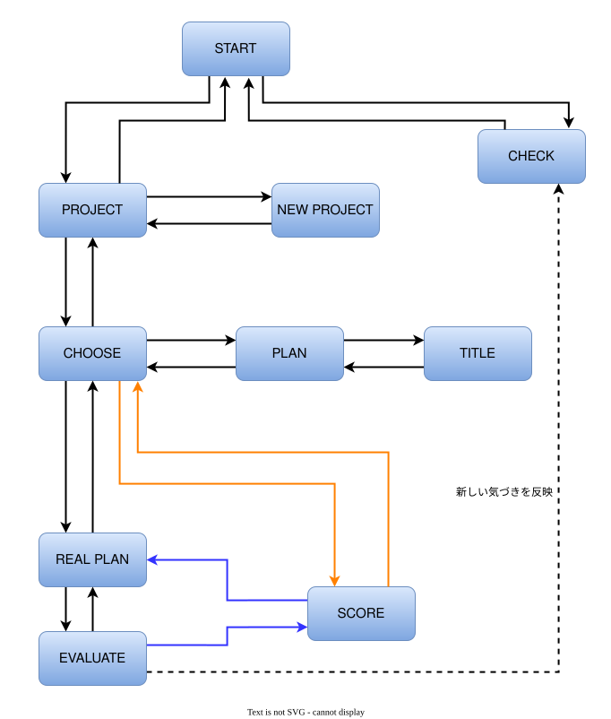

# RE:PLAN

## アプリの概要
SPAJAM2026 第1回予選のテーマ「ワクワク」をきっかけに、旅行の予定を立てているときの「ワクワク」に着目して開発したアプリです。

旅行では、予定を立てているときは期待が高まっている一方、実際に訪れてみると「思っていたより良くなかった」と感じることがあります。RE:PLANでは、予定と実際の体験を振り返り、その結果を次の予定づくりに活かすことで、「ワクワク」の下がり幅を小さくすることを目指します。

## 主な機能

### 1. 旅行の予定を立てる

旅行などのまとまりを「プロジェクト」として作成し、その中に行きたい場所ややりたいことを「プラン」として登録できます。

#### スタート画面

<-- スクショ -->

「プロジェクトを見る」から、旅行の予定を作成・確認できます。また、「気を付ける」から、過去の体験から蓄積したCHECK項目を確認できます。

#### プロジェクト画面

<-- スクショ -->

作成したプロジェクトを一覧で確認できます。＋ボタンから新しいプロジェクトを作成できます。

#### 新規プロジェクト作成画面

<-- スクショ -->

プロジェクト名・日付・プロジェクトを表す写真を登録して、新しいプロジェクトを作成できます。

#### プラン画面

<-- スクショ -->

プロジェクトに登録されている予定を一覧で確認できます。＋ボタンから新しいプランを追加できます。

#### 新規プラン作成画面

<-- スクショ -->

予定の名前と、理想の体験をイメージした写真（IMAGE PHOTO）を登録できます。

### 2. 過去の経験を次の予定づくりに活かす

旅行を重ねる中で得た「次は気を付けたいこと」や「事前に確認しておきたいこと」をCHECK項目として蓄積できます。

#### CHECK画面

<-- スクショ -->

過去の体験から得た「次は気を付けたいこと」や「確認しておきたいこと」を一覧で確認できます。

次に予定を立てる際にCHECK画面を確認することで、過去の経験から得た気づきを思い出し、**「次はここに気を付けよう」と意識して予定を立てることができます。**

また、実際の体験を評価する中で新たな気づきがあった場合は、その内容をCHECK項目として追加できます。こうして旅行を重ねるほど、自分自身の経験から得た「気を付けるべきこと」が蓄積されていきます。

### 3. 予定と実際の体験を比較して評価する

予定したことを実際に体験した後、理想としていた体験と実際の体験を比較して振り返ることができます。

#### 評価するプランの選択画面

<-- スクショ -->

実際に体験したプランから、評価したいものを選択できます。複数のプランをまとめて評価することもできます。

#### 評価画面

<-- スクショ -->

実際の体験を撮影した写真（REAL PHOTO）を登録し、CHECKで設定した評価項目について○/×で評価します。

IMAGE PHOTOとして残した「理想の体験」とREAL PHOTOとして残した「実際の体験」を比較することで、**予定していた体験と実際の体験との違いを振り返ることができます。**

また、体験を通して新たな気づきがあった場合は、「新しい気づき」として追加できます。追加した項目は、次回以降のCHECK項目として活用できます。

### 4. 旅行全体をスコアで振り返る

#### スコア画面

<-- スクショ -->

評価したプランの結果をプロジェクト単位で集計し、100点満点のスコアとして確認できます。

評価したプラン数や評価項目数、○・×の数、新しく気づいた項目数なども確認でき、旅行全体を振り返ることができます。

こうした振り返りによって得られた気づきを次の予定づくりに活かすことで、**過去の経験を次の「ワクワク」につなげていきます。**

## アプリ画面

### 画面遷移

## デモ
実際に作成者が使ってみた動画がこちらになります。また、以下のリンクから飛んでいただくと実際にアプリをお使いいただけます。
- iOS
- Android

## 技術構成

### アプリ開発

| 分類 | 技術 |
| --- | --- |
| フレームワーク | React Native / Expo |
| 言語 | TypeScript |
| 画面遷移 | Expo Router |

### 開発環境・ツール

| 分類 | 技術 |
| --- | --- |
| バージョン管理 | Git / GitHub |
| 動作確認 | Expo Go |

## 開発の担当箇所

### [exuniqx](https://github.com/exuniqx) の担当箇所

#### 画面・機能
- START画面
- CHECK画面
- PROJECT画面
- NEW PROJECT画面
- EVALUATE画面
- SCORE画面

#### 統合・開発
- アプリ全体の画面統合・UIの統一
- 統合に伴うGit上のコンフリクトの解消

#### その他
- 画面遷移図の作成
- READMEの作成・整理

## 開発について
- イベント名：SPAJAM2026 第1回予選
- チーム名：ちりつも
- 開発期間：2026年8月8日～8月9日

## 工夫したところ

### 「ワクワク」の下がり幅に着目した設計

「ワクワク」というテーマを、旅行前の期待と旅行後の実体験とのギャップとして捉えました。

旅行前に理想の体験をIMAGE PHOTOとして記録し、旅行後にREAL PHOTOとして実際の体験を記録することで、理想と現実を比較しながら振り返れるようにしました。

### 過去の経験を次の予定づくりに活かす仕組み

旅行を重ねる中で得た気づきをCHECK項目として蓄積し、次の予定を立てる際に確認できるようにしました。

一方で、過去の気づきをすべて毎回の評価項目にすると項目数が増えすぎてしまうため、ユーザー自身が今後も確認したい汎用的な気づきをCHECK項目として登録する仕組みにしました。

また、実際の体験を評価する際に新しい気づきを追加できるようにすることで、自分自身の経験に合わせてCHECK項目を更新できるようにしました。

### 写真を活用した「ワクワク」の可視化

旅行前に理想の体験をイメージした写真を登録し、プラン一覧にもその写真を表示するようにしました。

予定を文字だけで管理するのではなく、旅行前の「こんな体験をしたい」というイメージを写真として残すことで、プラン一覧そのものが旅行への期待感が伝わる画面になるようにしました。

### あえて予定に時間を設定しない設計

プランを作成する際には、あえて具体的な時間を設定しないようにしました。

旅行では予定通りに時間が進まないことが多く、細かく時間を設定しても実際の行動とのずれが生じやすいためです。

時間のずれをあらかじめ防ごうとするのではなく、実際に体験した後に「時間通りに進まなかった」こと自体を評価・振り返りの対象にできるようにしました。

### 旅行の体験を数値化して振り返る

個々のプランの評価結果をプロジェクト単位で集計し、100点満点のスコアとして表示することで、旅行全体を直感的に振り返れるようにしました。

また、評価したプラン数や評価項目数、○・×の数、新しく追加された気づきの数なども表示し、単純な点数だけでなく、旅行をどのように振り返ったのかも確認できるようにしました。

## 生成AIの活用

RE:PLANの開発・改善・ドキュメント作成では、生成AIを補助ツールとして活用しました。
生成された内容をそのまま採用するのではなく、実際のアプリの仕様や利用シーンに照らし合わせながら、必要な修正・調整を行いました。

### UI・画面設計

#### Google Stitch

画面UIの案を生成し、アプリのコンセプトや利用シーンに合わせた画面構成・デザインの検討に活用しました。

### 実装・開発支援

#### GitHub Copilot

コードの実装や修正、GitHub上での開発作業の支援に活用しました。
生成されたコードを確認・修正しながら、実際のアプリの仕様に合わせて実装しました。

### 設計・問題解決・ドキュメント作成

#### ChatGPT

開発中の問題解決や仕様・画面構成の検討、Git・GitHubに関する作業の確認、READMEなどのドキュメント作成・整理に活用しました。

#### Claude

画面遷移図などの整理・検討に活用しました。

## 改善点

### 審査時にいただいた指摘

#### UIの統一感について

審査時に、日本語と英語が入り混じっていて見づらいという指摘をいただきました。

**改善内容**

画面上の表記を見直し、日本語・英語の表記を統一するように改善しました。

#### 利用シーンを想定したUIについて

審査時に、UIについてもう少し利用者が実際に使うシーンを想像し、そのイメージに近づけた方がよいという指摘をいただきました。

**改善内容**

実際の利用シーンを改めて想定し、画面構成やUIの見直しを行っています。

#### スコアの根拠について

審査時に、点数をつける際のスコアの根拠が薄いという指摘をいただきました。

**改善内容**

スコアの算出方法や、ユーザーが点数を見たときにその結果をどのように解釈するのかについて見直しています。

### 開発後に検討した改善点

#### アプリアイコンについて

開発期間内には反映できませんでしたが、アプリアイコンがExpo Goの初期アイコンのままになっているという課題があります。

**改善案**

RE:PLANのコンセプトに合わせたオリジナルのアプリアイコンを作成し、アプリとしての完成度を高めます。

#### アプリ名・変数名の統一について

開発の途中でアプリ名を決定したため、コード内に以前の名称が残っており、変数名などの命名が統一されていない箇所があります。

**改善案**

アプリ名をRE:PLANに統一し、変数名やその他の命名も見直すことで、コードの可読性を高めます。

#### 不要なコードについて

開発期間内には整理しきれず、不要になったコードが残っているという課題があります。

**改善内容**

不要になったコードを削除し、コードを整理しました。

#### UIの操作導線について

開発後に改めて画面構成を確認したところ、ヘッダーに戻るボタンを設置している画面にも、別の戻る操作を行うボタンが存在するなど、役割が重複している箇所があることに気づきました。

**改善案**

戻る操作を行うボタンの役割を整理し、同じ操作を行うボタンが複数存在しないように画面ごとの操作導線を見直します。